## 국가통계포털 데이터를 활용한 아파트 전세가격 예측

### 📝 데이터 수집
---

Target변수(아파트 전세가)를 위한 Feature변수 선정

- 교통(지하철역, 버스 정류장)
- 아파트 연식
- 학군(초, 중, 고, 대학교)
- 인프라(스타벅스, 병원, 한강, 마트)
- 치안(CCTV)

수집 방법 : 공공데이터 활용, 크롤링(Selenium)

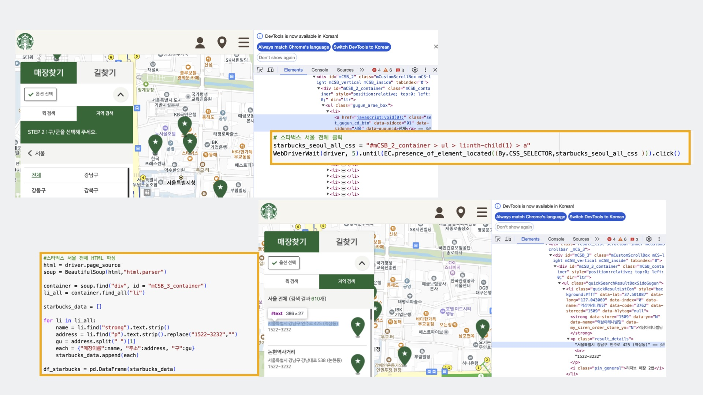

### 📝 데이터 전처리
---

1. 도로명주소/좌표 → 법정동주소 변경(카카오 API 활용)
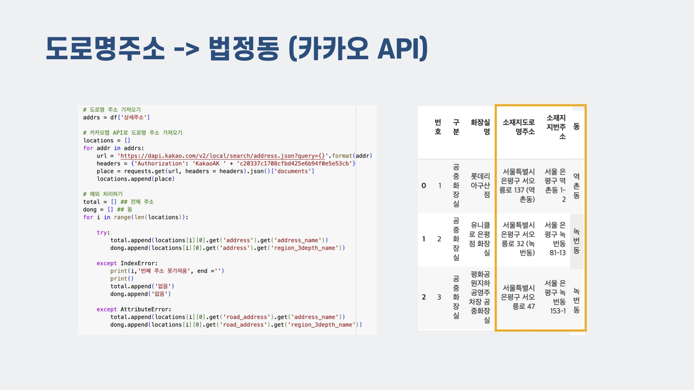

2. 전세 데이터 부족으로 월세 데이터를 전세로 변환
    - 구별 전월세 전환율, 4대은행 평균 대출 금리, 법정 금리의 평균을 산출해 전세 변환

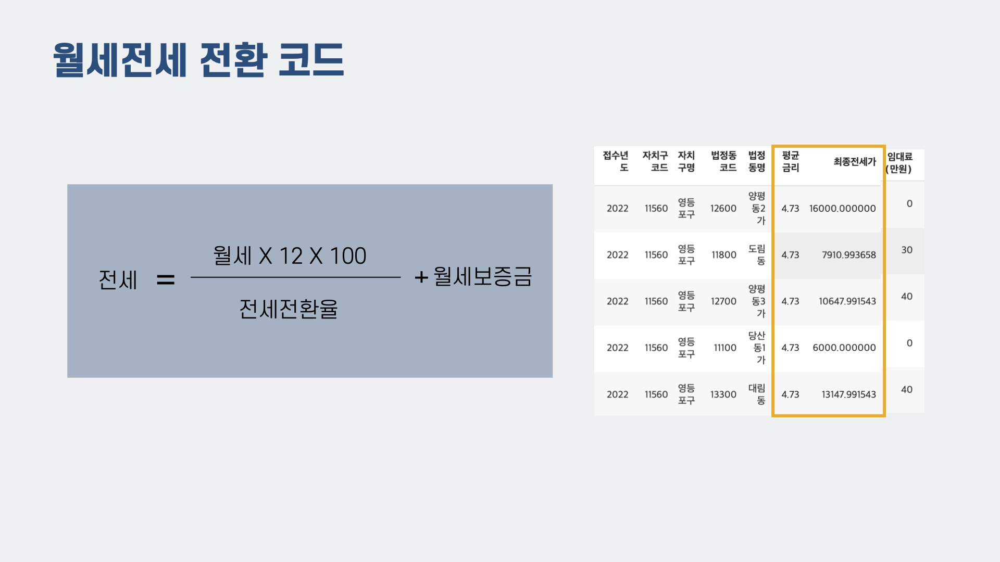

3. 결측치 처리
    - 전세가 : 표준편차에 영향을 줄 것으로 판단, 데이터 제거
    - 연식 : 100년 이상, -3년 미만 이상치로 판단, 데이터 제거
    - 층수 : 단독 다가구는 1층, 아파트 -1~-4층은 -1층(지하)으로 처리

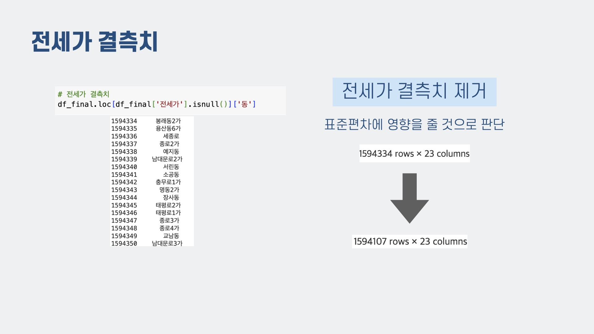

- 층수 : 방법 2가지를 정확도 비교 후 방법 2로 선정
    - 방법 1 : 동별, 구별 평균치로 결측치 처리
    - 방법 2 : 동별, 구별 평균치 컬럼 추가

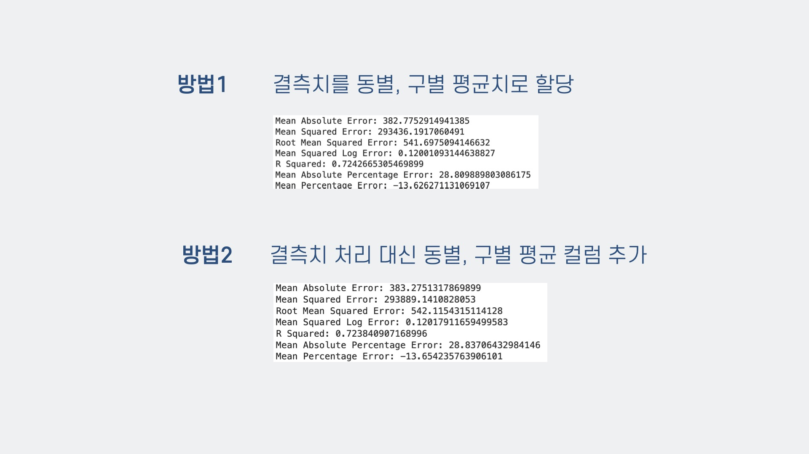

### 📝 시각화
---

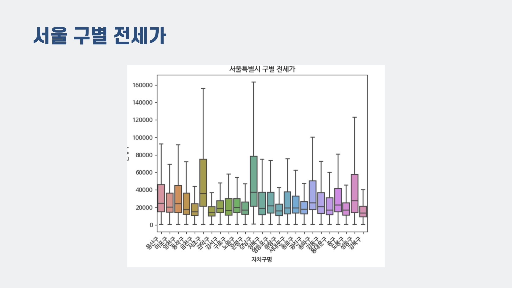
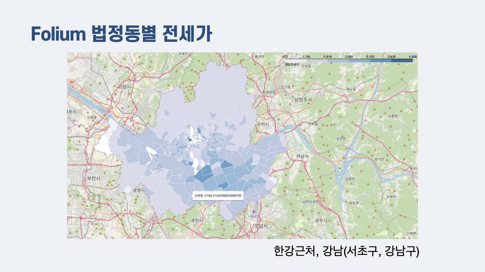
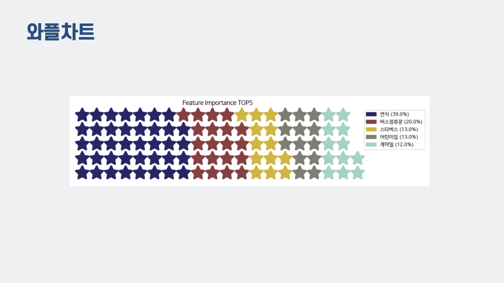
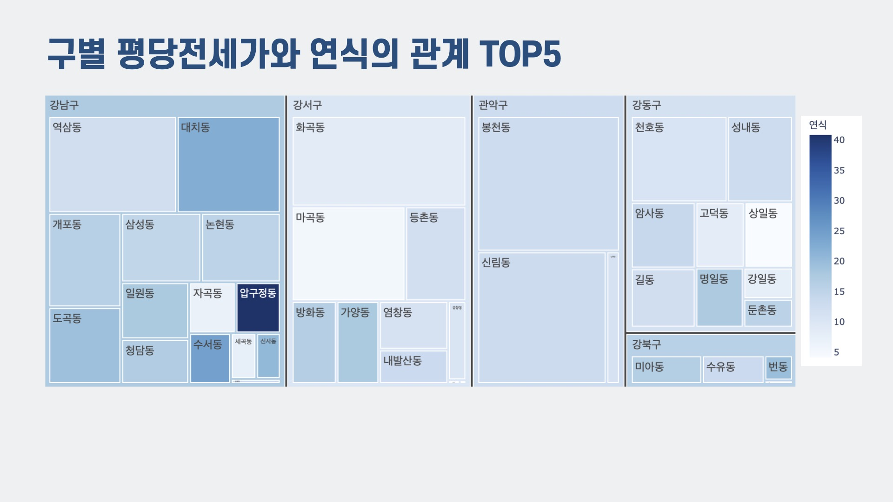

### 📝 예측 모델링
---

- 회귀 모델 RMSLE 비교 후 LGBM으로 선정\
(XGB와 큰 차이가 나지 않지만 속도, 성능을 고려하여 LGBM으로 선정)

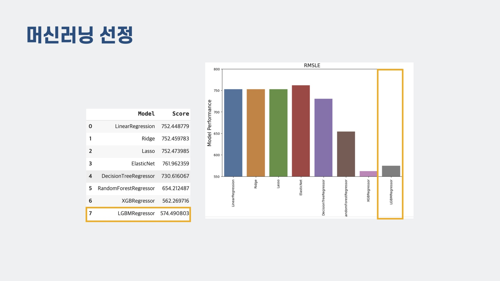

- 하이퍼파라미터 조정

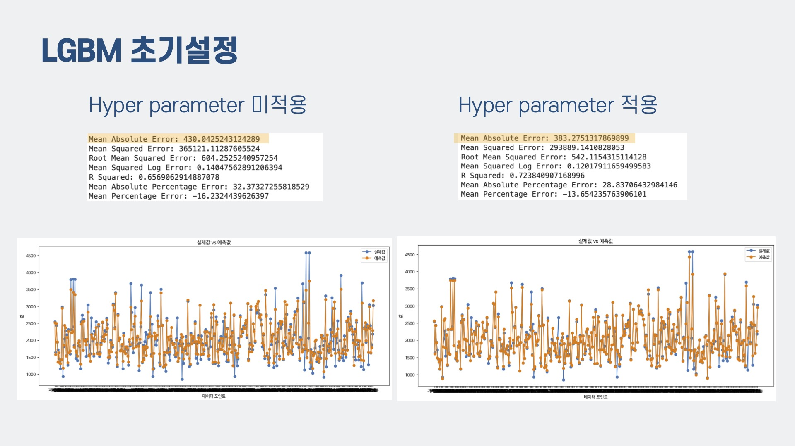

\
**[ 수행도구 ]**
- Python
- Pandas
- 시각화(Seaborn, Matplotlib, Folium, Plotly)
- Scikit-Learn
- 카카오 API
- 웹크롤링(Selenium)

\
**[ 역할 ]**
- 김민정(팀장) : 데이터 수집(크롤링), 데이터 전처리(학군)
- 강알리샤 : 데이터 전처리(인프라), EDA
- 유건 : 데이터 전처리(교통), 데이터 시각화(Folium)
- 한희주 : 데이터 전처리(이상치, 결측치 처리), 회귀 모델링

\
**[ 일정 ]**
23.12.12 ~ 24.01.03